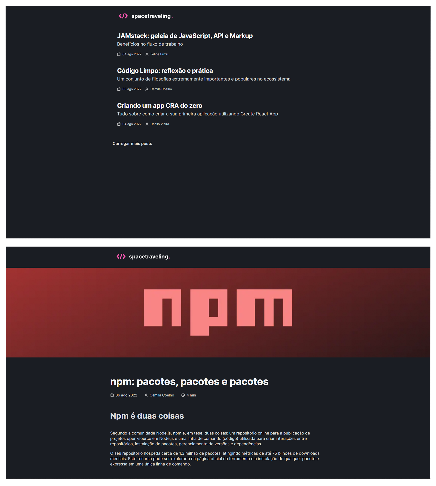

<p align="center">
    
</p>

<h1 align="center">
    
</h1>

## 💻 Projeto

SpaceTravelling é um desafio obrigário do bootcamp da @Rocketseat. Onde foi proposta a criação de um blog integrado ao PrismicCMS, utilizando o GetStaticProps e GetStaticPaths para criação de rotas dinâmicas e estáticas.

Este é um projeto desenvolvido visando o aprendizado da biblioteca ReactJS.

## 🎨 Layout

Você pode visualizar o layout do projeto através do link abaixo:

- [Layout Web](https://www.figma.com/file/86y35UjBuHhhVLQjTCwHoH/spacetraveling)

Lembrando que você precisa ter uma conta no [Figma](http://figma.com/).

## 🧪 Tecnologias

Esse projeto foi desenvolvido com as seguintes tecnologias:

- [React](https://reactjs.org)
- [TypeScript](https://www.typescriptlang.org/)
- [Next.js](https://nextjs.org/)
- [Prismic CMS](https://prismic.io/)
- [Utterances](https://utteranc.es/)
- [Date-fns](https://date-fns.org/)

## 🚀 Como executar

Clone o projeto e acesse a pasta do mesmo.

```bash
$ git clone https://github.com/Diegooliveyra/spacetraveling.git
$ cd spacetraveling
```

Para iniciá-lo, siga os passos abaixo:

```bash
# Instalar as dependências
$ yarn

# Iniciar o projeto
$ yarn dev
```

O app estará disponível no seu browser pelo endereço http://localhost:3000.

## 📝 License

Esse projeto está sob a licença MIT. Para mais detalhes:

<a href="https://opensource.org/licenses/MIT" target="_blank"></a>
